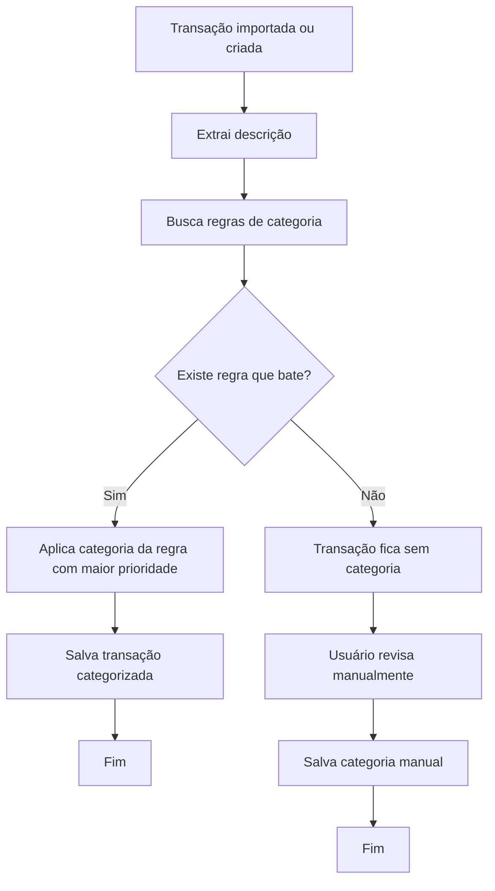

# Fluxo de categorização

Fluxo para categorizar transações automaticamente ou manualmente.

## Observações

- As regras devem buscar padrões de texto.
- A prioridade define qual categoria deve vencer quando houver múltiplas regras.
- Esse fluxo reduz trabalho manual e melhora a experiência no uso recorrente.
