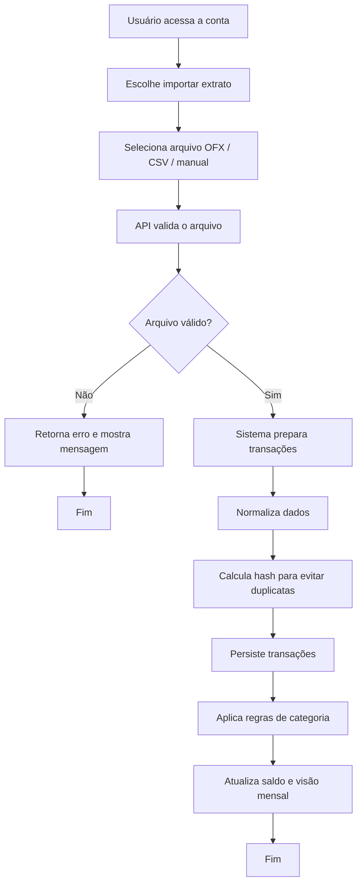

# Fluxo de importação

Este fluxo representa o processo principal de importação de dados financeiros para o Fluxi.

## Observações

- O objetivo é reduzir esforço manual.
- A importação deve ser idempotente.
- O hash evita duplicar lançamentos ao reimportar um período já processado.
- A v1 prioriza OFX e CSV, com suporte manual.
