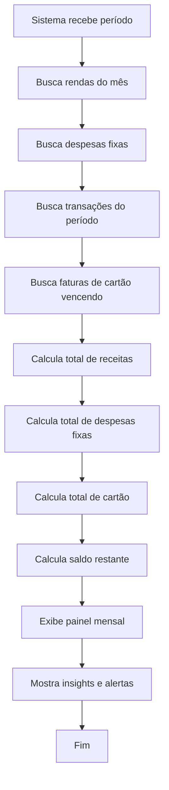

# Fluxo da visão mensal

Fluxo de cálculo e visualização do mês financeiro.

## Observações

- A visão mensal é o coração do produto.
- O sistema deve considerar o que vence no mês, e não necessariamente o que foi comprado no mês.
- O objetivo é mostrar quanto sobra antes de decisões financeiras mais complexas.
