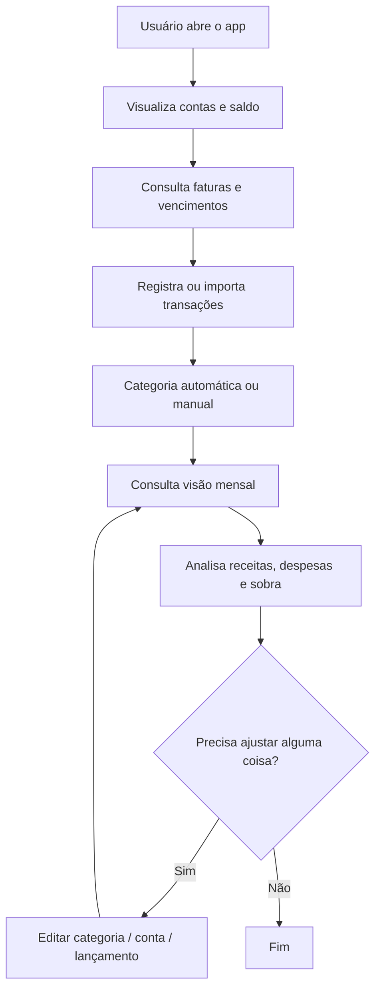

# Fluxo do usuário

Visão geral da jornada do usuário dentro do Fluxi.

## Observações

- A experiência principal gira em torno da visão mensal.
- O fluxo deve ser simples e rápido para uso diário.
- O usuário não deve precisar categorizar tudo manualmente.
