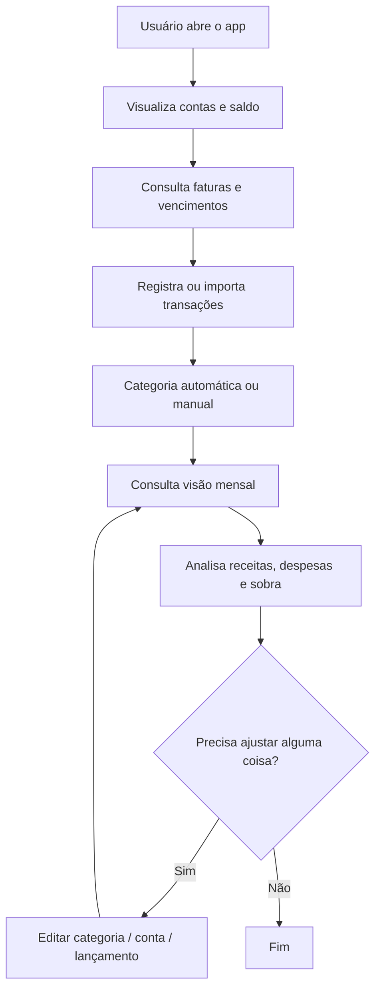

# Fluxo do usuário

Visão geral da jornada do usuário dentro do Fluxi.

## Ciclo de vida da conta

Ao cadastrar uma conta, ela começa ativa. O usuário pode:

- alterar nome, banco, tipo ou método de importação conforme as regras do
    domínio;
- inativar uma conta que não será mais utilizada;
- reativar uma conta inativa;
- consultar o histórico de uma conta inativa.

As operações de ativação e inativação são idempotentes: repetir uma operação
que já corresponde ao estado atual não altera o resultado.

A conta não é excluída fisicamente, porque transações, faturas, rendas e
outros registros dependentes precisam permanecer disponíveis para o histórico
financeiro.

## Observações

- A experiência principal gira em torno da visão mensal.
- O fluxo deve ser simples e rápido para uso diário.
- O usuário não deve precisar categorizar tudo manualmente.
